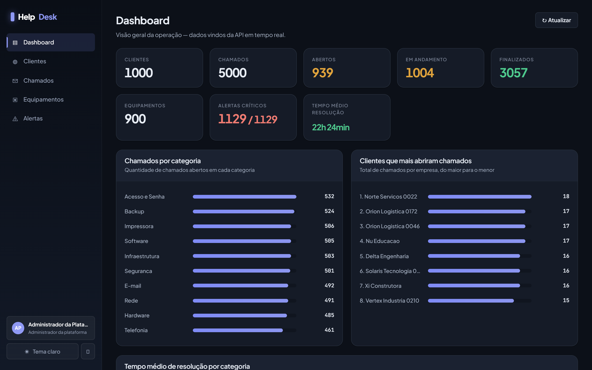
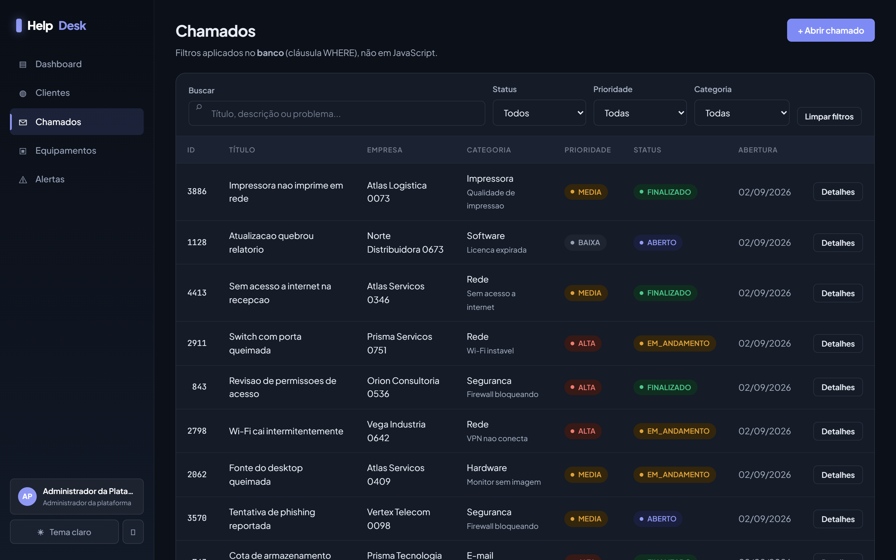
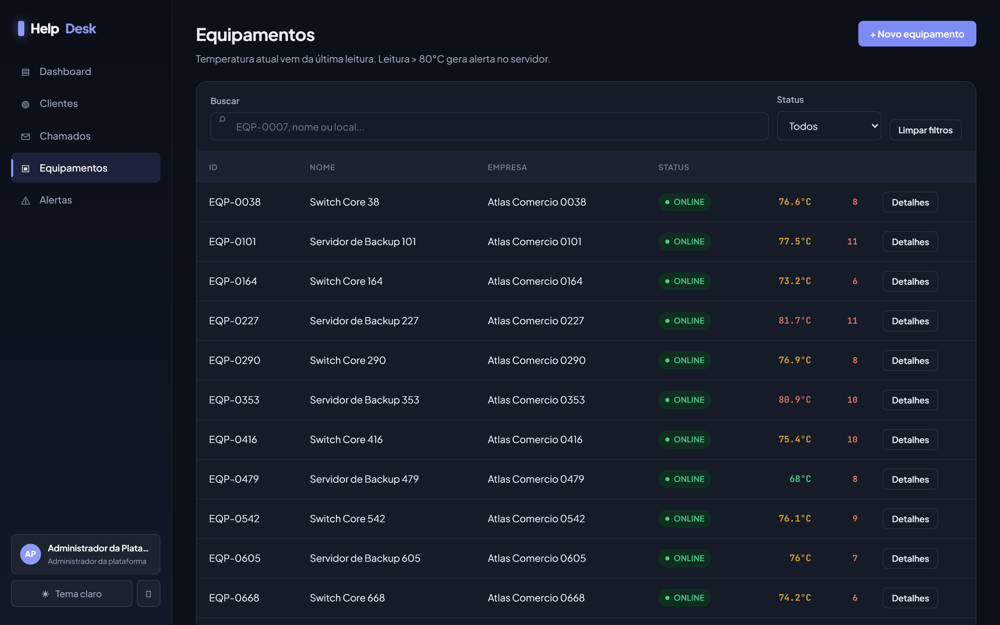
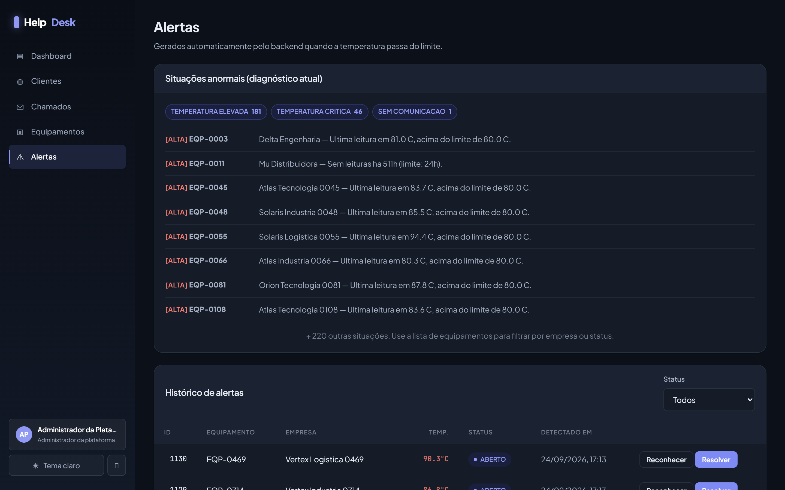
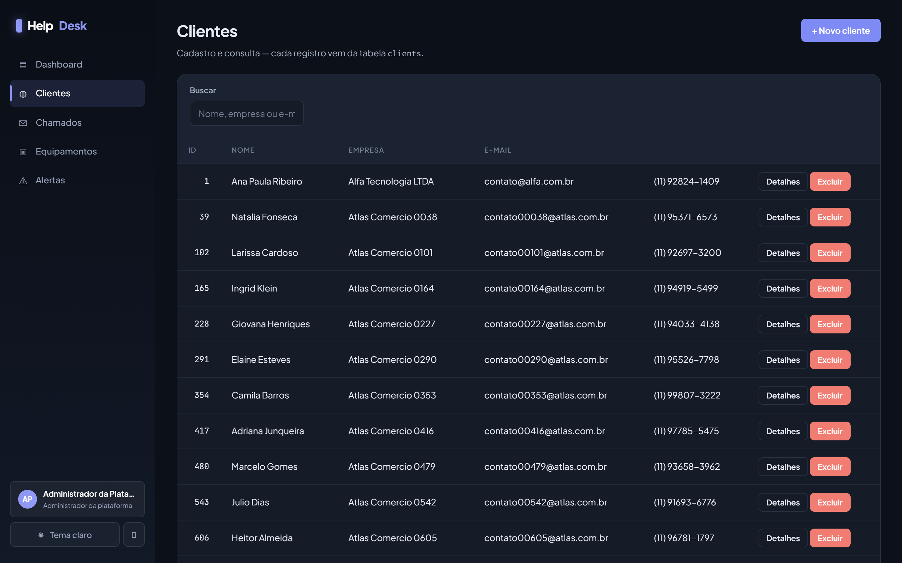
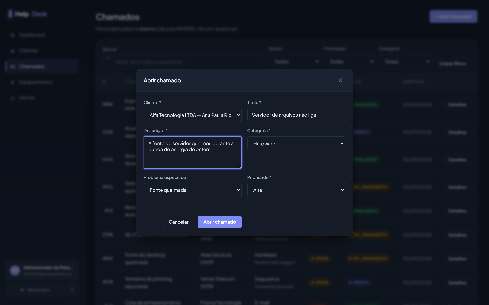
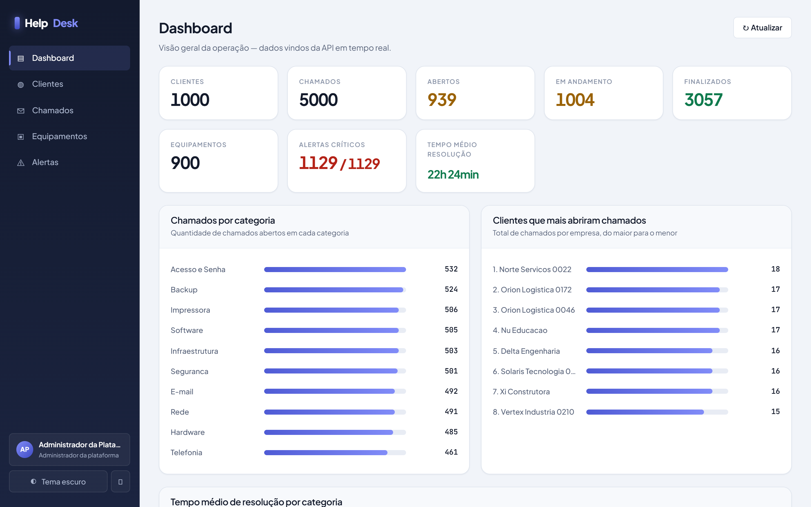
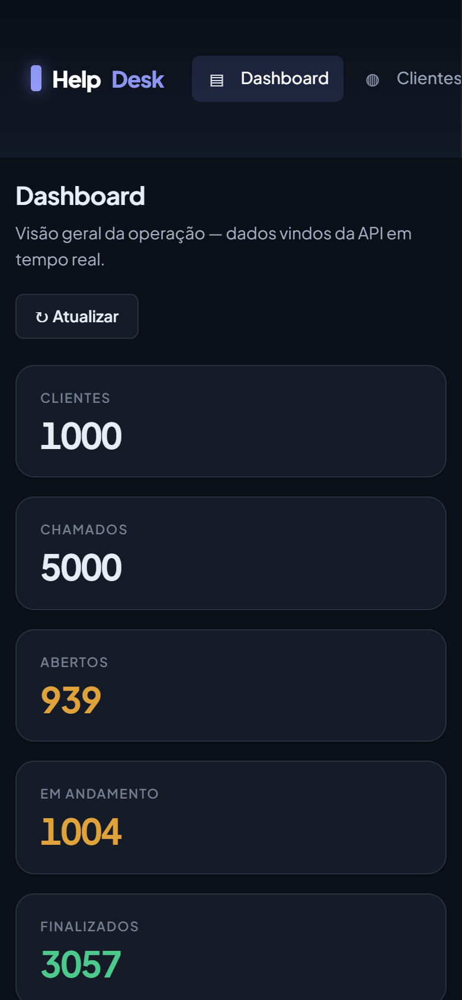
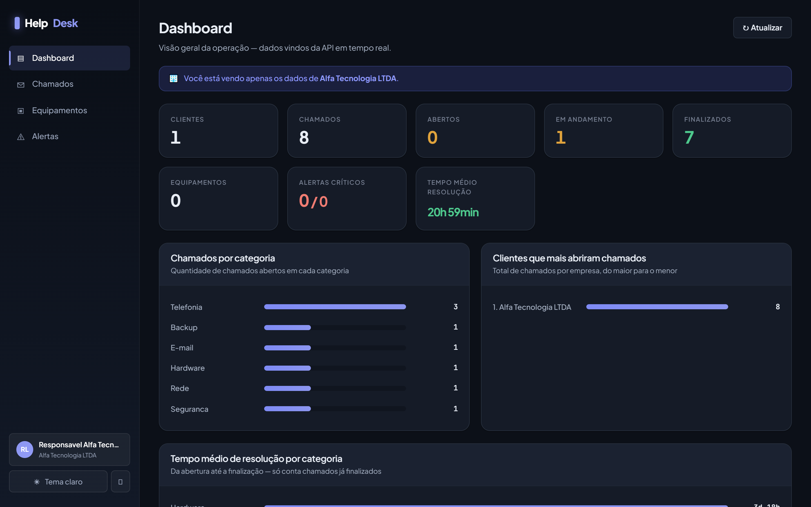
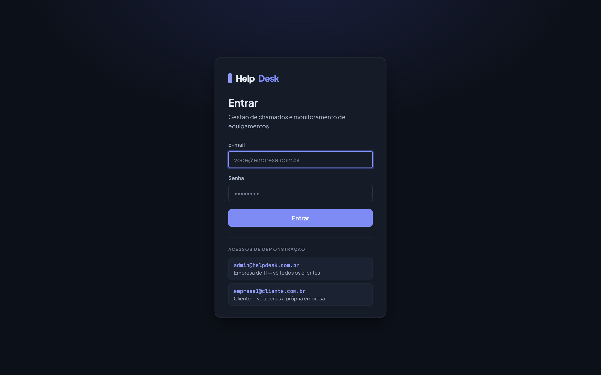

<div align="center">

# HelpDesk & Monitoring Platform

**Plataforma de gestão para empresas de TI que atendem outras empresas.**
Chamados, análises e monitoramento de equipamentos com alerta automático de temperatura.




</div>

---

## O problema

Uma empresa de TI terceirizada atende dezenas de outras empresas. Hoje ela controla isso
por planilha e grupo de WhatsApp — e não consegue responder três perguntas básicas:

- **Quantos chamados estão abertos agora, e de quem?**
- **Quanto tempo a gente leva para resolver?** (o número que vai para a renovação do contrato)
- **Aquele servidor está esquentando?** — descoberto só quando para, de madrugada.

Esta plataforma responde as três. E a terceira ela responde **sozinha**: um agente coletor
lê a temperatura dos equipamentos periodicamente e o servidor grava um alerta quando
ultrapassa o limite, sem ninguém digitar nada.

---

## Como funciona, em uma imagem

```
     AGENTE COLETOR                    NAVEGADOR
   (sensor, sem tela)                (HTML + CSS + JS)
           │                                │
           └──────────  HTTP / JSON  ────────┘
                            │
            ┌───────────────▼────────────────┐
            │  ROUTERS    falam HTTP          │
            │  SCHEMAS    validam (422)       │
            │  SERVICES   ★ as regras         │
            │  MODELS     viram tabelas       │
            └───────────────┬────────────────┘
                            │  SQL parametrizado
                     SQLite · data/app.db
```

A regra de negócio mora **no servidor**, não no JavaScript. É isso que faz o agente
coletor — que não tem navegador nenhum — disparar exatamente os mesmos alertas que
a tela dispararia.

---

## As telas

<table>
<tr>
<td width="50%">

**Chamados** — busca no banco, filtros combináveis e paginação sobre 5.000 registros



</td>
<td width="50%">

**Equipamentos** — temperatura atual e alertas abertos, numa consulta só



</td>
</tr>
<tr>
<td width="50%">

**Alertas** — anomalias resumidas por tipo + histórico paginado



</td>
<td width="50%">

**Clientes** — cadastro com validação e busca por nome, empresa ou e-mail



</td>
</tr>
</table>

### Abrir chamado: categoria e problema encadeados

O segundo campo só libera depois que a categoria é escolhida, e as opções vêm da API —
não há lista escrita no HTML. Uma fonte da verdade, duas pontas sempre iguais.



### Tema claro e escuro

Um atributo em `<html>` troca ~200 regras de uma vez, porque nenhuma delas usa cor
direta — todas apontam para variáveis CSS.



### Responsivo



---

## Multi-empresa: cada cliente vê só o que é dele

O mesmo dashboard, com dois logins diferentes:

| Empresa de TI (`SUPER_ADMIN`) | Cliente atendido (`ADMIN_EMPRESA`) |
|---|---|
|  |  |
| 1.000 clientes · 5.000 chamados | **1 cliente · 8 chamados** |
| menu "Clientes" visível | menu oculto + faixa de aviso |

O isolamento não é cosmético: nasce de uma única dependência
([`deps.py`](backend/app/deps.py)) que desce até todos os services e vira `WHERE` no banco —
**inclusive no analytics**, porque número agregado também vaza informação.

Trocar o id na URL não ajuda: a checagem de dono é feita também no acesso direto
(proteção contra [IDOR](https://owasp.org/www-project-top-ten/)), e há teste automatizado
para isso.

---

## Rodando o projeto

**Pré-requisito:** Python 3.10+

```bash
git clone https://github.com/BragaDudu/helpdesk-monitoring-platform.git
cd helpdesk-monitoring-platform
python -m venv .venv && .venv\Scripts\activate
pip install -r requirements.txt
```

Crie o `.env` a partir do exemplo e **gere a sua própria chave**:

```bash
copy .env.example .env
python -c "import secrets; print(secrets.token_urlsafe(48))"
```

Popule o banco e suba o servidor:

```bash
python -m backend.seed --reset
python -m uvicorn backend.app.main:app --reload --port 8010
```

Abra **http://localhost:8010** — ou use os atalhos: `INICIAR.bat`, `TESTES.bat`,
`BANCO.bat`, `COLETOR.bat`.

### Acessos criados pelo seed

| E-mail | Senha | Enxerga |
|---|---|---|
| `admin@helpdesk.com.br` | `admin12345` | tudo |
| `empresa1@cliente.com.br` | `empresa12345` | só a Alfa Tecnologia |



### Gerando volume

```bash
python -m backend.seed --reset --scale 50     # 5.000 chamados, 1.000 clientes
python -m backend.seed --reset --chamados 200 # número exato
```

### O agente coletor

Simula os sensores enviando leituras. **Deixe rodando numa janela separada** e veja
os alertas nascendo sozinhos:

```bash
python -m backend.agent --intervalo 60 --lote 150
```

Ele não importa nada do backend — fala HTTP, como o navegador, só que sem navegador.
Num cliente real, a única função que mudaria é a que gera a temperatura: em vez de
simular, leria o hardware.

---

## As três regras de negócio

### 1. Temperatura acima do limite gera alerta

[`monitoring_service.py`](backend/app/services/monitoring_service.py) — leitura e alerta
entram na **mesma transação**:

```python
db.add(reading)
db.flush()                              # gera o id, ainda não confirma

if payload.temperature > threshold:     # ★ estritamente MAIOR: 80.0 não dispara
    db.add(Alert(reading_id=reading.id, ...))

db.commit()                             # os dois viram permanentes, juntos
```

É impossível existir no banco uma leitura de 90°C sem o alerta dela. E a coluna
`alerts.reading_id` é `UNIQUE`: uma leitura gera no máximo um alerta, garantido pelo
banco e não por um `if`.

### 2. Máquina de estados do chamado

```
ABERTO  ⇄  EM_ANDAMENTO  ─→  FINALIZADO
                                  ╳  não volta
```

Transição proibida devolve **409**. `FINALIZADO` não volta porque ao finalizar o servidor
carimba `closed_at` — um chamado "aberto" com data de fechamento quebraria o cálculo de
tempo médio.

### 3. Cliente com histórico não é excluído

Devolve **409** em vez de apagar em silêncio. A chave estrangeira usa `ON DELETE RESTRICT`
como rede de segurança: mesmo que a checagem falhasse, o banco recusaria.

---

## Segurança

| | |
|---|---|
| **Senhas** | PBKDF2-HMAC-SHA256, 240.000 iterações, salt por usuário. A senha nunca é guardada. |
| **Token** | assinado com HMAC-SHA256. Não é criptografado (não há segredo nele) — o que ele garante é **integridade**: sem a chave não dá para virar admin editando o papel. |
| **SQL Injection** | impossível por construção: valores vão como parâmetro (`VALUES (?, ?, ?)`), e nome de coluna na ordenação passa por lista branca. |
| **XSS** | todo texto vindo do banco passa por `escapeHtml` antes de ir para a tela. |
| **Enumeração de usuários** | "e-mail não existe" e "senha errada" devolvem a mesma mensagem, e gastam o mesmo tempo. |
| **Segredos** | `SECRET_KEY` mora no `.env`, que está no `.gitignore`. |

**Limitação conhecida e assumida:** o token fica no `localStorage`, que um XSS conseguiria
ler. Em produção com dado real, o certo é cookie `httpOnly` + CSRF — porque ali a regra é
não depender de uma barreira só.

---

## Testes

```bash
python -m pytest -q        # ou TESTES.bat
```

**55 testes**, com banco em memória isolado do `data/app.db`. Cobrem as três regras de
negócio, a validação, a paginação e — o mais importante — o **isolamento entre empresas**,
incluindo uma varredura que percorre as 14 rotas de leitura e falha se alguma responder
sem token.

---

## Escala

Medido com as sete consultas reais do dashboard:

| Chamados | Arquivo | Dashboard inteiro |
|---:|---:|---:|
| 5.000 | 2,6 MB | **25 ms** |
| 50.000 | 25 MB | 413 ms |
| 200.000 | 100 MB | 1.602 ms |

O gargalo que aparece primeiro não é o tamanho do banco — é o dashboard recalcular tudo a
cada acesso, com `GROUP BY` varrendo a tabela. A saída seria cache ou tabela de resumo.

As análises são feitas **no banco**, com `GROUP BY`; o Python só embrulha em JSON. Trazer
5.000 linhas para somar em memória funcionaria hoje e travaria em 200 mil.

---

## Estrutura

```
backend/
  app/
    routers/     33 rotas — falam HTTP, sem regra de negócio
    schemas/     contratos JSON (Pydantic) — validam e formatam
    services/    ★ as regras de negócio
    models/      6 tabelas (SQLAlchemy)
    deps.py      autenticação e escopo por empresa
    security.py  hash de senha e token
  agent.py       o coletor (simula os sensores)
  seed.py        popula o banco com volume configurável
  tests/         55 testes
frontend/
  js/api.js      ★ camada única de fetch (token + tratamento de erro)
  js/auth.js     sessão no navegador
  css/style.css  design system com tokens, tema claro/escuro
data/app.db      o banco (não versionado)
```

---

## Documentação

| Arquivo | O que tem |
|---|---|
| [CONCEITOS.md](CONCEITOS.md) | o vocabulário: API, ORM, migration, transação |
| [BANCO_DE_DADOS.md](BANCO_DE_DADOS.md) | as 6 tabelas e as decisões de modelagem |
| [AUTENTICACAO_EXPLICADA.md](AUTENTICACAO_EXPLICADA.md) | como o login funciona por dentro |
| [GUIA_COMPLETO.md](GUIA_COMPLETO.md) | passo a passo de uso |

A API se documenta sozinha: com o servidor no ar, **http://localhost:8010/docs** abre o
Swagger com as 33 rotas navegáveis.

---

<div align="center">

Projeto de avaliação técnica · Guilherme Braga

</div>
